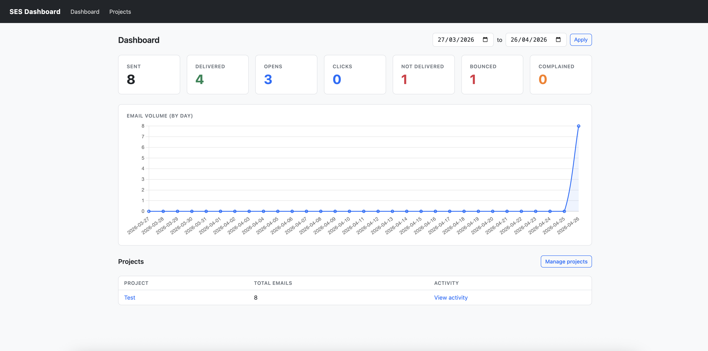
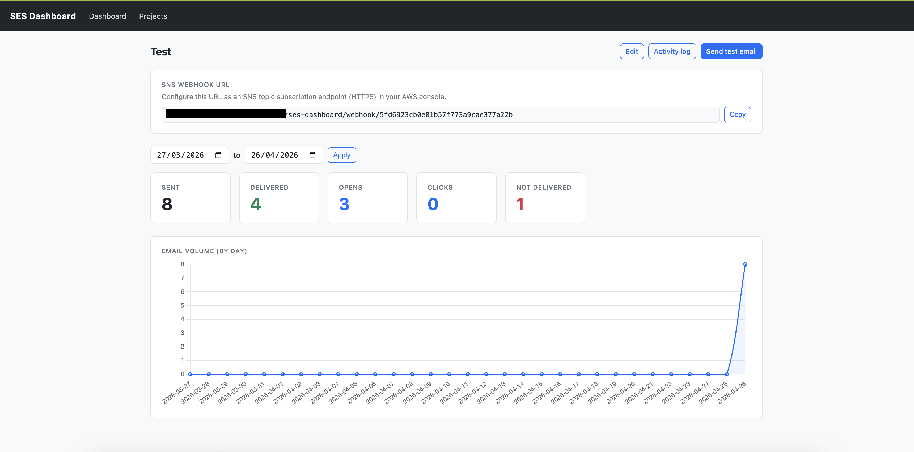
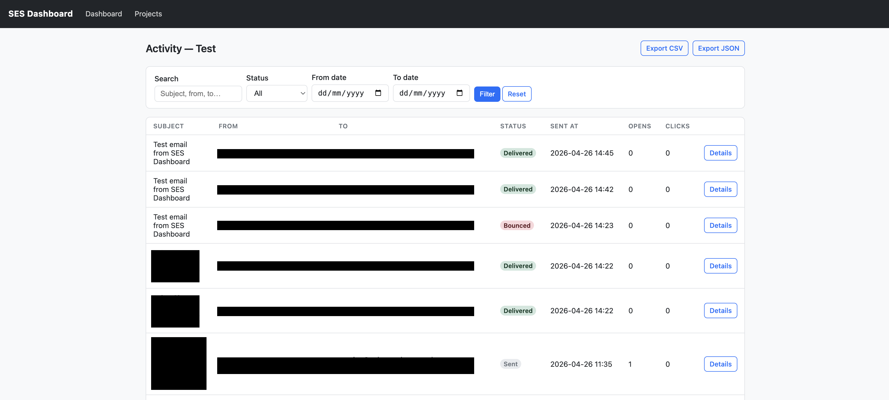
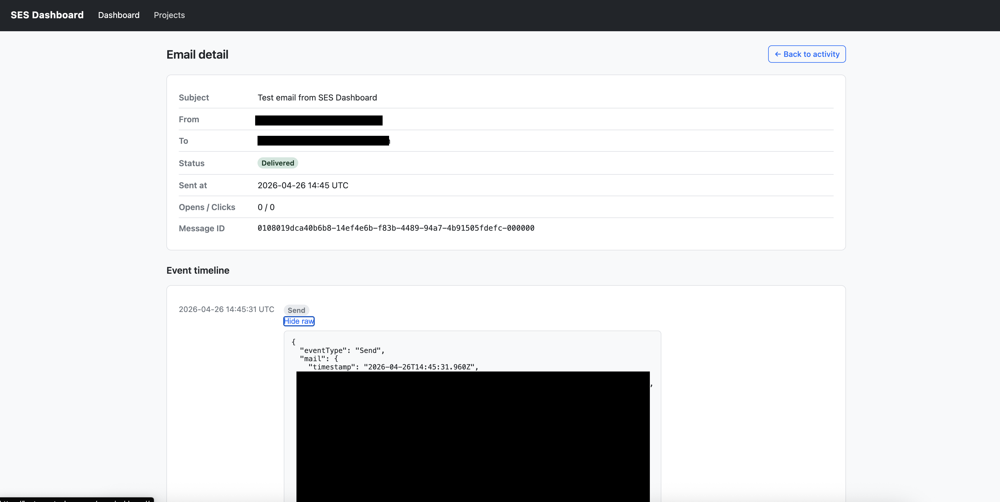
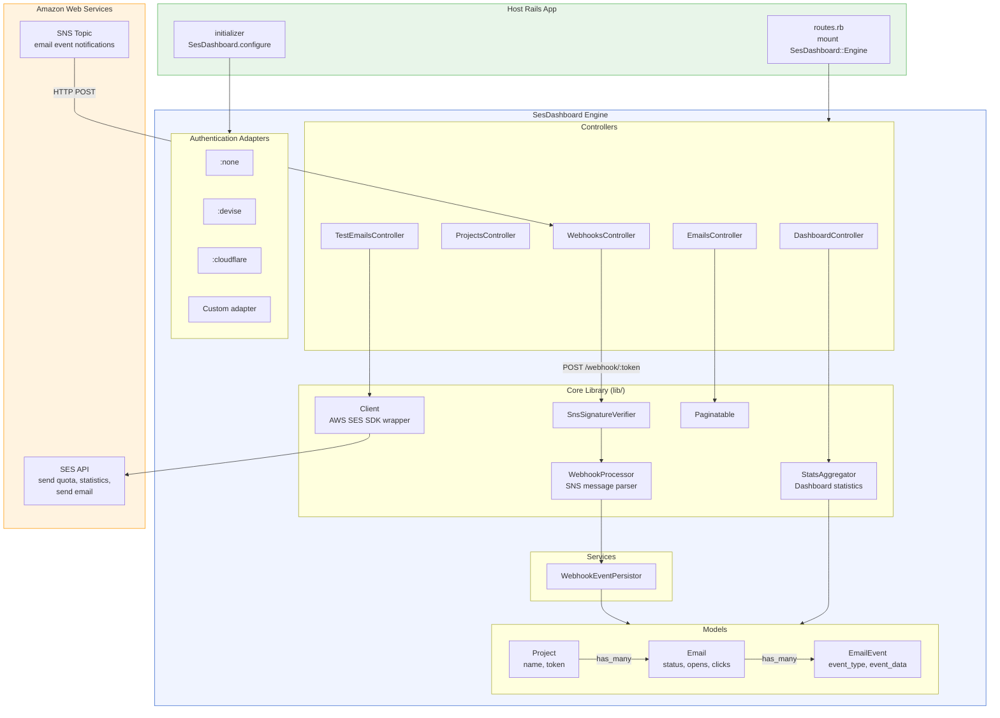

# SES Dashboard
[](https://codecov.io/gh/antodoms/ses_dashboard)
[](https://badge.fury.io/rb/ses-dashboard)

A mountable Rails engine that provides a real-time dashboard for Amazon SES, tracking email delivery, bounces, complaints, opens, and clicks via SNS webhooks.

## Screenshots



<table>
  <tr>
    <td></td>
    <td></td>
  </tr>
  <tr>
    <td align="center"><em>Per-project stats &amp; email volume chart</em></td>
    <td align="center"><em>Paginated activity log with search &amp; export</em></td>
  </tr>
  <tr>
    <td colspan="2"></td>
  </tr>
  <tr>
    <td colspan="2" align="center"><em>Email detail with full SNS event timeline</em></td>
  </tr>
</table>

## Features

- **Real-time webhook processing** -- receives SNS notifications for delivery, bounce, complaint, open, click, reject, and rendering failure events
- **Per-project dashboards** -- stat cards, email volume charts (Chart.js), and paginated activity logs
- **Pluggable authentication** -- ships with Devise, Cloudflare Zero Trust, and no-auth adapters; bring your own with any object that responds to `#authenticate(request)`
- **CSV/JSON export** -- export filtered email activity from any project
- **Test email sending** -- send test emails directly from the dashboard via the SES API
- **Status state machine** -- unidirectional email status transitions (sent -> delivered/bounced/etc.)
- **SNS signature verification** -- validates RSA signatures (SHA1 and SHA256) on incoming SNS messages
- **Database agnostic** -- works with SQLite, PostgreSQL, and MySQL
- **Lightweight pagination** -- no external pagination gem required

## Architecture



## Installation

Add the gem to your Gemfile:

```ruby
gem "ses-dashboard"
```

The gem name uses a hyphen (`ses-dashboard`) — Bundler will auto-require the correct entry point automatically.

Then run:

```bash
bundle install
bin/rails railties:install:migrations
bin/rails db:migrate
```

## Mounting

Mount the engine in your `config/routes.rb`:

```ruby
Rails.application.routes.draw do
  mount SesDashboard::Engine, at: "/ses-dashboard"
end
```

The dashboard is now available at `/ses-dashboard`.

## Configuration

Create an initializer at `config/initializers/ses_dashboard.rb`:

```ruby
SesDashboard.configure do |c|
  # AWS credentials (optional — the SDK credential chain is used by default:
  # SSO, IAM roles, instance profiles, environment variables, etc.)
  c.aws_region            = "us-east-1"
  c.aws_access_key_id     = ENV["AWS_ACCESS_KEY_ID"]
  c.aws_secret_access_key = ENV["AWS_SECRET_ACCESS_KEY"]
  c.endpoint              = nil  # set to "http://localhost:4566" for LocalStack

  # Authentication adapter — :none, :devise, :cloudflare, or a custom object
  c.authentication_adapter = :devise

  # Cloudflare Zero Trust (only needed when using :cloudflare adapter)
  c.cloudflare_team_domain = "myteam.cloudflareaccess.com"
  c.cloudflare_aud         = "your-application-aud"

  # Dashboard behaviour
  c.per_page        = 25     # rows per page in the activity log
  c.time_zone       = "UTC"  # timezone for chart date grouping
  c.test_email_from = "noreply@example.com"

  # Caching & security
  c.cache_enabled        = true   # cache SES API responses in memory
  c.verify_sns_signature = true   # validate SNS signatures (enable in production)
end
```

## Authentication

Every controller action (except the webhook endpoint) runs through the configured authentication adapter.

| Adapter | Value | Notes |
|---|---|---|
| None | `:none` | Open access — suitable for development |
| Devise | `:devise` | Calls `authenticate_user!` via Warden |
| Cloudflare Zero Trust | `:cloudflare` | Validates `CF_Authorization` JWT against JWKS |
| Custom | any object | Must respond to `#authenticate(request)` returning truthy/falsy |

### Custom adapter

Use a custom adapter when your app has its own authentication system (e.g. custom session-based auth, API keys, JWT):

```ruby
# config/initializers/ses_dashboard.rb

my_auth = Class.new(SesDashboard::Auth::Base) do
  def authenticate(request)
    session = request.session
    # your auth logic here — return truthy to allow, falsy to deny
    session[:user_id].present?
  end
end

SesDashboard.configure do |c|
  c.authentication_adapter = my_auth.new
end
```

For apps with session timeout and whitelist checks (e.g. custom Rails session auth):

```ruby
my_auth = Class.new(SesDashboard::Auth::Base) do
  def authenticate(request)
    session = request.session
    user_id      = session[:user_id]
    logged_in_at = session[:logged_in_at]

    return false unless user_id && logged_in_at
    return false unless logged_in_at > 12.hours.ago

    user = User.find_by(id: user_id)
    user&.active? || false
  end
end

SesDashboard.configure do |c|
  c.authentication_adapter = my_auth.new
end
```

The adapter is defined inline using `Class.new` so it is available at initializer load time without depending on Zeitwerk autoloading.

## SNS Webhook Setup

Each project gets a unique webhook URL displayed on its dashboard page:

```
https://yourapp.com/ses-dashboard/webhook/<project-token>
```

To connect it to SES:

1. In the **AWS SNS console**, create a topic (or use an existing one).
2. Add a **subscription** with protocol **HTTPS** and the webhook URL above. The engine auto-confirms the subscription.
3. In the **SES console**, configure a **Configuration Set** with an SNS destination pointing to that topic. Select the event types you want to track (Send, Delivery, Bounce, Complaint, Open, Click, Reject, Rendering Failure).

The webhook endpoint authenticates via the project token in the URL and does not require a session.

### SNS Signature Verification

When `verify_sns_signature = true`, the engine validates the RSA signature on every incoming SNS message before processing it. Both `SignatureVersion` `"1"` (SHA1) and `"2"` (SHA256) are supported.

For **raw message delivery** (SNS subscription setting), signature verification is automatically skipped as SNS does not include signature fields in raw payloads — the project token in the URL provides authentication instead.

Enable in production:

```ruby
c.verify_sns_signature = Rails.env.production?
```

## Development

### Prerequisites

- Docker & Docker Compose (for system specs and local AWS)
- Ruby >= 3.0

### Setup

```bash
git clone <repo-url>
cd ses-dashboard
docker compose run --rm web bundle install
```

### Running Tests

```bash
# All tests (unit + controller + system) inside Docker
docker compose run --rm web bundle exec rspec

# Unit and controller tests only (no Docker needed)
bundle exec rspec spec/models spec/controllers spec/ses_dashboard

# Single test file
bundle exec rspec spec/models/ses_dashboard/email_spec.rb

# Single example by line number
bundle exec rspec spec/models/ses_dashboard/email_spec.rb:15
```

### Docker Compose Services

| Service | Purpose | Ports |
|---|---|---|
| `localstack` | Local AWS (SES + SNS) | 4566 |
| `chrome` | Selenium standalone Chromium | 4444 (WebDriver), 7900 (noVNC — watch tests live) |
| `web` | Runs the test suite | 4001 (Puma) |

### Watching System Tests

Open http://localhost:7900 in your browser (no password) to watch Chrome execute system specs in real time via noVNC.

## Database Schema

The engine creates three tables (prefixed `ses_dashboard_`):

| Table | Key Columns |
|---|---|
| `ses_dashboard_projects` | `name`, `token` (unique, auto-generated), `description` |
| `ses_dashboard_emails` | `project_id`, `message_id` (unique), `source`, `destination` (JSON), `subject`, `status`, `opens`, `clicks`, `sent_at` |
| `ses_dashboard_email_events` | `email_id`, `event_type`, `event_data` (JSON), `occurred_at` |

Email statuses: `sent`, `delivered`, `bounced`, `complained`, `rejected`, `failed`.

Migrations are compatible with Rails 7.x and 8.x — the migration version is resolved automatically from the host app's Rails version at install time.

## License

MIT
